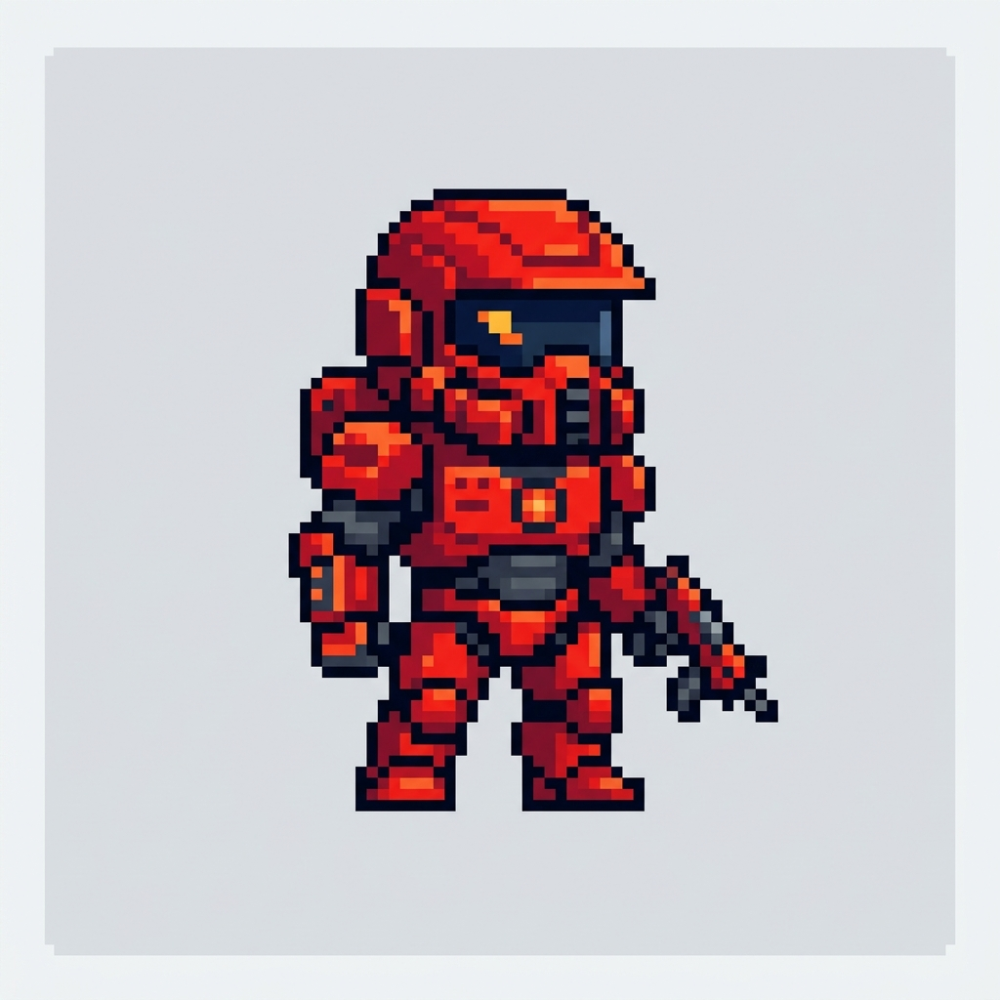

# 🚀 Arena Shooter: 2D Combat Arena

**Arena Shooter**, HTML5 Canvas ve Vanilla JavaScript ile geliştirilmiş, hızlı tempolu, aksiyon dolu bir 2D arena savaş oyunudur. Arkadaşınızla aynı bilgisayarda (PvP) veya akıllı botlara karşı (PvE) mücadele edin!

## 🌟 Özellikler

-   **⚔️ Çeşitli Oyun Modları:** 1 Oyuncu (Botlara karşı) veya 2 Oyuncu (Arkadaşına karşı) modu.
-   **🏟️ Dinamik Arenalar:**
    -   **Klasik Arena:** Dengeli ve stratejik.
    -   **Tehlikeli Çukur:** Boşluklara dikkat, düşerken ölme!
    -   **Kafes Labirent:** Dar alanlarda hızlı çatışmalar.
    -   **Rastgele Harita:** Her seferinde farklı bir deneyim.
-   **🔫 Geniş Silah Yelpazesi:**
    -   **Pistol:** Sınırsız mermi, güvenilir.
    -   **Shotgun:** Yakın mesafede yıkıcı.
    -   **Machine Gun:** Seri ateş gücü.
    -   **Bomba Atar:** Alan hasarı veren patlayıcılar.
    -   **Füze:** Çok yüksek hasar ve itiş gücü.
-   **🔄 Halkasal Kesintisiz Geçiş (Screen Wrap):** Ekranın bir yanından çıkıp diğer yanından sürpriz saldırılar yapın!
-   **🎮 Gamepad Desteği:** Tam kontrollü oyun deneyimi için oyun kumandası bağlayın.
-   **🔊 Dinamik Ses Efektleri:** Silah sesleri ve patlamalarla atmosferi hissedin.

## 🕹️ Kontroller

### Klavye
| Aksiyon | Oyuncu 1 (P1) | Oyuncu 2 / Bot (P2) |
| :--- | :--- | :--- |
| **Hareket** | `W`, `A`, `D` | `↑`, `←`, `→` |
| **Ateş Et** | `F` | `O` |
| **Silah Al/Bırak** | `G` | `P` |
| **Duraklat** | `Esc` | `Esc` |

### Gamepad 🎮
-   **Sol Analog / D-Pad:** Hareket
-   **A Butonu:** Zıpla
-   **X / RT:** Ateş Et
-   **Y / B:** Silah Etkileşimi

## 🚀 Nasıl Çalıştırılır?

Bu projeyi yerel bilgisayarınızda çalıştırmak için:

1.  Bu depoyu (repository) klonlayın.
2.  `index.html` dosyasını herhangi bir modern web tarayıcısında açın.
3.  Veya yerel bir sunucu (Live Server vb.) kullanarak çalıştırın.

## 🛠️ Teknik Detaylar

-   **Dil:** Vanilla JavaScript (ES6+)
-   **Grafik:** HTML5 Canvas API
-   **Stil:** Modern CSS3
-   **Ses:** Web Audio API (Prosedürel ses üretimi)

---
Geliştiren: Muhammed Furkan Karaşın
